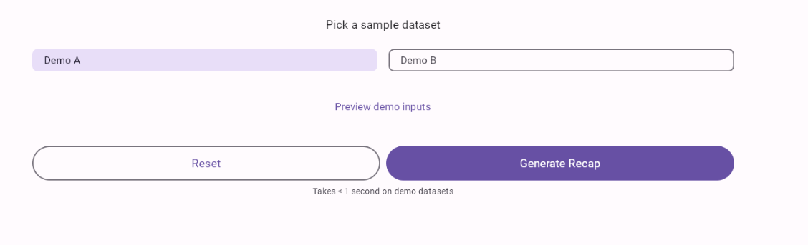
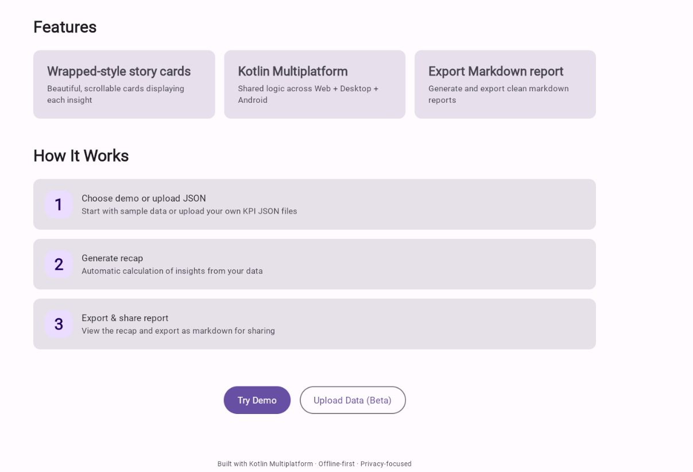
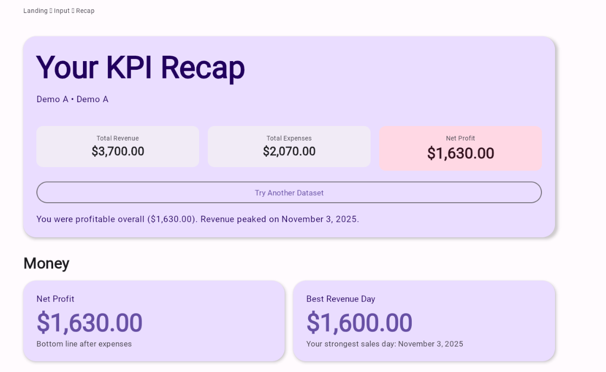
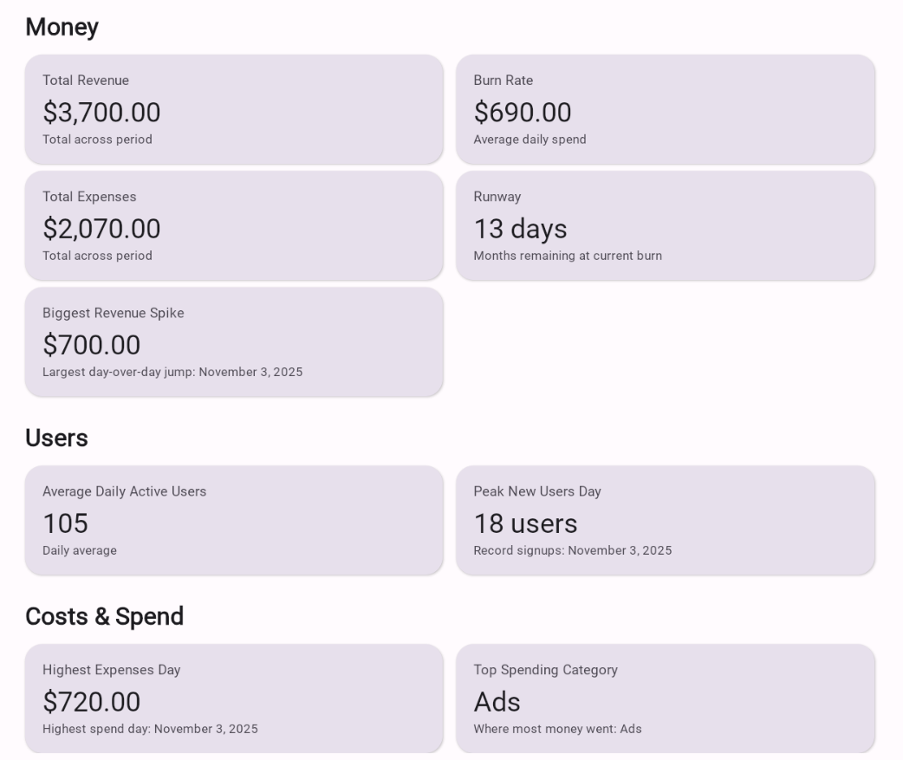

# PulseWrap

**Deterministic KPI insight generation across Android, Desktop, and Web**

---

## Overview

PulseWrap transforms structured JSON performance datasets into human-readable narrative summaries. Built with Kotlin Multiplatform and Compose Multiplatform, it computes 11 deterministic business metrics and generates markdown reports with identical results across Android, Desktop (JVM), and Web (Wasm) platforms.


---

## Quick Start (Desktop)

```bash
./gradlew :desktopApp:run
```

The application launches with a window interface. Select a dataset variant (Demo A or Demo B) to generate insights in under a second.

---

## Motivation

### The Problem

Data analysts and product managers spend significant time manually analyzing performance datasets to extract actionable insights. The process requires:
- Calculating aggregates (revenue, expenses, profit)
- Identifying trends (best days, spikes, peaks)
- Generating contextual narratives
- Formatting results for sharing

Manual analysis introduces inconsistencies: different tools produce different results, platform-specific calculations diverge, and formatting varies across export methods.

### The Solution

PulseWrap automates the entire pipeline—from JSON parsing to insight computation to narrative generation—using pure functions that guarantee deterministic, reproducible results. The shared Kotlin Multiplatform codebase ensures identical calculation logic across all platforms while enabling native platform integrations where appropriate.

### Why It Matters

**Determinism**: The same dataset produces identical insights regardless of platform. This eliminates calculation discrepancies and enables reliable cross-platform workflows.

**Code Reuse**: The vast majority of business logic and UI code is shared across platforms. Platform-specific implementations are minimal (~20 lines each) and isolated to resource loading and sharing mechanisms.

**Native Integrations**: Platform-specific features (Android share intents, desktop file exports, web clipboard APIs) enhance UX without compromising shared logic.

---

## Features

The landing page showcases PulseWrap's key capabilities: Wrapped-style story cards, Kotlin Multiplatform architecture, and Markdown export functionality.

### Core Metrics (11 Deterministic Insights)

PulseWrap computes the following metrics from daily KPI records and category spending data:

**Financial Aggregates:**
- Total Revenue
- Total Expenses
- Net Profit (with profitability status)

**Peak Analysis:**
- Best Revenue Day (date and amount)
- Highest Expenses Day (date and amount)
- Biggest Revenue Spike (day-over-day change)

**User Metrics:**
- Average Daily Active Users
- Peak New Users Day (date and count)

**Operational Metrics:**
- Burn Rate (average daily expenses)
- Runway (days until cash depletion, computed from last cash balance)
- Top Spending Category (aggregated from category spending data)

### Narrative Generation

Contextual summaries prioritize insights by significance:
- Profitability status (profit/loss)
- Notable highlights (revenue spikes > $1000 take precedence over routine best days)
- Contextual date formatting
- Human-readable phrasing

### Export & Sharing

**Platform-Specific Implementations:**
- **Android**: System share intent integration for markdown reports
- **Desktop**: File export to user home directory with timestamped filenames (format: `PulseWrap_Report_YYYYMMDD_HHMMSS.md`)
- **Web (Wasm)**: In-browser markdown preview and copy-to-clipboard functionality

All platforms generate identical markdown content; only the sharing mechanism differs.

### Data Processing

- **JSON Parsing**: Lenient parsing with `kotlinx.serialization` (ignores unknown keys, handles malformed data gracefully)
- **Date Handling**: ISO-8601 parsing with `kotlinx.datetime` (cross-platform date operations)
- **Formatting**: Platform-specific locale support for currency and number formatting
- **Error Handling**: Graceful degradation for malformed dates, empty datasets, and missing fields

### Scope & Limitations

**Current Scope:**
- Predefined dataset variants (Demo A, Demo B) bundled with the application
- Static JSON file parsing (no live data sources)
- 11 fixed metric types (no user-configurable insights)
- Markdown export format only

**Explicitly Excluded (Future Work):**
- Custom dataset upload (requires file picker implementations per platform)
- Real-time data feeds (requires API integration layer)
- PDF/CSV export formats (requires additional libraries)
- Data visualization (requires charting libraries)
- Multi-dataset comparison (requires state management enhancements)

---

<details>
<summary><strong>Technical Implementation</strong> — Architecture, design decisions, and trade-offs</summary>

### Architecture

PulseWrap follows a layered architecture with clear separation between business logic, data access, and platform-specific implementations:

```
shared/commonMain/
├── engine/          # Pure functions (stateless, deterministic)
│   ├── InsightEngine.kt        # Core metric computation
│   ├── NarrativeGenerator.kt   # Contextual summary generation
│   ├── MarkdownGenerator.kt    # Report formatting
│   └── CaptionGenerator.kt     # Insight caption generation
├── model/           # Data classes (KpiDaily, CategorySpend, InsightCard, RecapData)
├── data/            # Repository pattern
│   ├── DatasetLoader.kt (expect)  # Platform-agnostic interface
│   └── DatasetRepository.kt       # Business logic orchestration
├── util/            # Formatting helpers
│   ├── Formatters.kt (expect)     # Platform-specific formatting
│   └── DateRangeUtils.kt          # Date range calculations
└── ui/              # Compose Multiplatform screens
    ├── LandingScreen.kt           # Dataset selection
    ├── InputScreen.kt             # Loading state
    ├── RecapScreen.kt             # Insights display
    └── MarkdownPreviewScreen.kt   # Export preview

Platform-specific implementations:
├── androidMain/     # Android resource loading (AssetManager), share intent
├── desktopMain/     # JVM resource loading (ClassLoader), file system export
└── wasmJsMain/      # Inline JSON strings (no file system), browser clipboard APIs
```

### Key Design Decisions & Trade-offs

#### 1. Pure Function Architecture

**Decision**: All insight computation functions are stateless and deterministic. No side effects, no mutable state.

**Rationale:**
- **Testability**: Unit tests require no platform dependencies or mocks
- **Determinism**: Same inputs always produce identical outputs across platforms
- **Debugging**: Isolated functions simplify troubleshooting
- **Concurrency Safety**: Stateless functions are inherently thread-safe

**Implementation:**
```kotlin
object InsightEngine {
    fun computeInsights(
        daily: List<KpiDaily>,
        spend: List<CategorySpend>
    ): List<InsightCard> {
        // Pure computation: no I/O, no mutable state, no side effects
        // Returns List<InsightCard> deterministically
    }
}
```

**Trade-offs:**
- **Pros**: Simplicity, reliability, testability
- **Cons**: All data must be loaded into memory (acceptable for current dataset sizes)

#### 2. Expect/Actual Pattern for Platform Abstraction

**Decision**: Use Kotlin's `expect`/`actual` mechanism for platform-specific resource loading and formatting.

**Rationale:**
- **WebAssembly Constraints**: No file system access; requires inline data or fetch APIs
- **Android**: Uses `AssetManager` for bundled resources
- **Desktop**: Uses Java `ClassLoader.getResourceAsStream()` for JVM resources
- **Formatting**: Each platform has different locale/formatting APIs (Android `NumberFormat`, JVM `DecimalFormat`, JS `Intl.NumberFormat`)

**Implementation Example:**
```kotlin
// commonMain
expect object DatasetLoader {
    fun loadText(path: String): String
}

// wasmJsMain - inline JSON (no file system)
actual object DatasetLoader {
    actual fun loadText(path: String): String {
        return when (path) {
            "kpi_daily_A.json" -> """[...]"""
            else -> throw RuntimeException("Unknown dataset: $path")
        }
    }
}

// desktopMain - JVM resource loading
actual object DatasetLoader {
    actual fun loadText(path: String): String {
        val resourceStream = DatasetLoader::class.java.classLoader
            .getResourceAsStream("/$path")
        return resourceStream.bufferedReader().use { it.readText() }
    }
}
```

**Trade-offs:**
- **Pros**: Type-safe platform APIs, compile-time verification, clean abstraction
- **Cons**: Requires maintaining three implementations (~20 lines each), but isolated to resource access layer

**Performance Consideration**: Inline JSON in Wasm increases bundle size (~2KB per dataset), but eliminates runtime fetch overhead. Acceptable trade-off for demo datasets.

#### 3. Conditional Android Plugin Application

**Decision**: Conditionally apply the Android Gradle plugin only when the Android SDK is detected.

**Rationale:**
- Enables building desktop and web targets without Android toolchain
- Reduces setup friction for developers without Android Studio
- Allows CI/CD pipelines to build non-Android targets independently

**Implementation:**
```kotlin
val hasAndroidSdk = try {
    project.findProperty("android.sdk.dir") != null || 
    System.getenv("ANDROID_HOME") != null ||
    file("${System.getProperty("user.home")}/.android/sdk").exists()
} catch (e: Exception) {
    false
}

if (hasAndroidSdk) {
    apply(plugin = libs.plugins.android.library.get().pluginId)
    // ... configure Android target
}
```

**Trade-offs:**
- **Pros**: Flexible builds, reduced dependencies, better developer experience
- **Cons**: Android-specific code won't compile without SDK (expected and acceptable behavior)

#### 4. Compose Multiplatform for Shared UI

**Decision**: Use Compose Multiplatform for the entire UI layer instead of platform-native frameworks.

**Rationale:**
- **Code Reuse**: Single UI codebase maintains visual consistency across platforms
- **Declarative Framework**: Compiles to native Android views, Swing/Compose for Desktop, and WebAssembly DOM bindings
- **Material 3**: Consistent theming and design system
- **State Management**: Compose's reactive state model simplifies data flow

**Trade-offs:**
- **Pros**: Vast majority of UI code reused, consistent UX, modern declarative API, shared navigation logic
- **Cons**: WebAssembly target is experimental (but stable enough for this use case), larger initial bundle size for web

**Platform-Specific Rendering:**
- **Android**: Native `View` hierarchy via Compose Runtime
- **Desktop**: Compose for Desktop (Swing-based rendering)
- **Web**: Skiko WASM runtime with DOM bindings

#### 5. Narrative Generation with Priority-Based Highlighting

**Decision**: Narrative generator prioritizes insights based on significance thresholds, not just chronological order.

**Rationale:**
- Not all insights are equally interesting
- Revenue spikes > $1000 are more noteworthy than routine best revenue days
- Contextual summaries should highlight the most impactful metrics

**Implementation:**
```kotlin
object NarrativeGenerator {
    fun generateNarrative(recapData: RecapData): String {
        // Priority order:
        // 1. Biggest revenue spike (if > $1000)
        // 2. Best revenue day
        // 3. Top spending category
        // 4. Peak new users day
    }
}
```

**Trade-offs:**
- **Pros**: More actionable summaries, better user experience
- **Cons**: Hard-coded thresholds (could be configurable in future)

### Performance Considerations

**Dataset Size**: Current implementation efficiently handles datasets with hundreds of daily records. Insight computation is:
- **Time Complexity**: O(n) for most metrics, O(n log n) for sorting operations (best/worst day analysis)
- **Space Complexity**: O(n) for dataset storage, minimal overhead for computation

**Memory**: Stateless computation means minimal memory footprint. JSON parsing uses streaming where possible (`bufferedReader().use {}`).

**WebAssembly**: Inline JSON data increases bundle size (~2KB per dataset), but eliminates runtime fetch overhead. For production with dynamic datasets, fetch APIs would be preferred.

**Scalability Target**: Current implementation is optimized for datasets with < 1000 records. For larger datasets, future optimizations would include:
- Lazy loading
- Incremental computation
- Background processing (web workers for Wasm)

### Technology Stack

- **Kotlin Multiplatform** 2.0.21 (core multiplatform support)
- **Compose Multiplatform** 1.6.10 (shared declarative UI)
- **kotlinx.serialization** 1.7.0 (JSON parsing)
- **kotlinx.datetime** 0.6.1 (cross-platform date operations)
- **kotlinx.coroutines** 1.8.0 (asynchronous operations)

</details>

---

## How to Build & Run

### Prerequisites

- **JDK 17 or higher** (required for all targets)
- **Gradle** (wrapper included, downloads automatically)
- **Android SDK** (optional, only required for Android builds)
  - Set `ANDROID_HOME` environment variable, or
  - Install Android Studio (auto-detects SDK location)
- **Modern browser** with WebAssembly support (Chrome/Chromium recommended for web target)

### Desktop (JVM)

```bash
# Windows
.\gradlew.bat :desktopApp:run

# macOS/Linux
./gradlew :desktopApp:run
```

The application launches with a window interface. Select a dataset variant (Demo A or Demo B) to generate insights. Markdown reports are exported to your home directory with filenames like `PulseWrap_Report_20250115_143022.md`.

**Export Location**: `~/PulseWrap_Report_*.md` (user home directory)

### Android

```bash
# Build debug APK
.\gradlew.bat :androidApp:assembleDebug  # Windows
./gradlew :androidApp:assembleDebug      # macOS/Linux
```

Install the APK on a device or emulator, or open the project in Android Studio and run the `androidApp` configuration.

**Sample Data**: JSON datasets are bundled in `androidApp/src/main/assets/`:
- `kpi_daily_A.json` / `kpi_daily_B.json`
- `category_spend_A.json` / `category_spend_B.json`

### Web (Wasm)

```bash
# Start development server
.\gradlew.bat :webApp:wasmJsBrowserDevelopmentRun  # Windows
./gradlew :webApp:wasmJsBrowserDevelopmentRun      # macOS/Linux
```

Open the URL shown in the terminal (typically `http://localhost:8080`) in a browser. The application runs entirely in the browser with no server-side dependencies.

**Production Build**:
```bash
.\gradlew.bat :webApp:wasmJsBrowserProductionWebpack  # Windows
./gradlew :webApp:wasmJsBrowserProductionWebpack      # macOS/Linux
```

Output is in `webApp/build/dist/wasmJs/productionExecutable/`.

### Build Verification

```bash
# Quick check (shared, desktop, web - no Android SDK required)
.\gradlew.bat quickCheck  # Windows
./gradlew quickCheck      # macOS/Linux

# Full check including Android (requires Android SDK)
.\gradlew.bat androidCheck  # Windows
./gradlew androidCheck      # macOS/Linux
```

### Sample Dataset Format

PulseWrap expects two JSON files per dataset:

**KPI Daily** (`kpi_daily_*.json`):
```json
[
  {
    "date": "2025-11-01",
    "revenue": 1200.0,
    "expenses": 700.0,
    "activeUsers": 95,
    "newUsers": 10,
    "cashBalance": 8000.0
  }
]
```

**Category Spend** (`category_spend_*.json`):
```json
[
  {
    "date": "2025-11-01",
    "category": "Ads",
    "amount": 120.0
  }
]
```

**Required Fields:**
- `date`: ISO-8601 format (YYYY-MM-DD)
- `revenue`, `expenses`: Numeric values
- `activeUsers`, `newUsers`: Integer values
- `cashBalance`: Optional numeric value (required for runway calculation)
- `category`, `amount`: Required for category spending files

---

## Demo / Usage Example

### Typical Workflow



1. **Select Dataset**: Choose "Demo A" or "Demo B" from the dataset selection screen



*Select a demo dataset (Demo A or Demo B) and click "Generate Recap" to process the data.*

2. **Generate Recap**: The app computes 11 insights and displays them as grouped cards with a narrative summary



*The recap screen shows key financial metrics (Total Revenue, Total Expenses, Net Profit) at a glance, with a narrative summary highlighting profitability and notable events.*

3. **Explore Detailed Insights**: Scroll through organized sections (Money, Users, Costs & Spend) to see all computed metrics



*Detailed view showing Money section metrics (Total Revenue, Burn Rate, Total Expenses, Runway, Biggest Revenue Spike) and Users section (Average Daily Active Users, Peak New Users Day).*


*Costs & Spend section displaying Highest Expenses Day and Top Spending Category with contextual dates.*

4. **Export Report**: Tap "Export Report" to view and export the markdown-formatted report


*The export screen shows the complete markdown report with all insights. Users can copy to clipboard or download the .md file on web, share via system intent on Android, or save to home directory on desktop.*

### Sample Output

**Insight Cards Display:**
```
Total Revenue: $3,700.00
Across 3 days

Net Profit: $1,180.00
Profitable period

Best Revenue Day: $1,600.00
On Nov 3, 2025

Biggest Revenue Spike: $700.00
On Nov 3, 2025

Top Spending Category: Ads
Total: $260.00
```

**Narrative Summary:**
> "You were profitable overall ($1,180.00). Your biggest revenue jump came on Nov 3, 2025."

**Markdown Export:**
```markdown
# PulseWrap KPI Recap

**Dataset:** Demo A
**Generated:** Nov 15, 2025

## Total Revenue
$3,700.00
Across 3 days

## Net Profit
$1,180.00
Profitable period

## Best Revenue Day
$1,600.00
On Nov 3, 2025

...
```

---

## Future Plans

### Short-term (Next Release)

- **Custom Dataset Input**: File picker for user-provided JSON datasets (desktop/web)
- **Additional Export Formats**: PDF generation, CSV export for raw insights
- **Extended Insight Types**:
  - Week-over-week and month-over-month trend analysis
  - Seasonality detection
  - Anomaly identification (statistical outliers)

### Medium-term (3-6 Months)

- **Data Visualization**: Charts and graphs for revenue trends, expense breakdowns, user growth curves
- **Comparison Mode**: Side-by-side analysis of multiple datasets
- **Template System**: Customizable narrative templates and insight prioritization
- **Performance Optimizations**:
  - Lazy loading for large datasets (1000+ records)
  - Incremental insight computation
  - Background processing for web target (Web Workers)

### Long-term (6+ Months)

- **iOS Target**: Extend to iOS using Compose Multiplatform
- **Real-time Data Sources**: API integration for live KPI feeds
- **Collaboration Features**: Share recaps with team members
- **Historical Tracking**: Store and compare recaps over time
- **Machine Learning**: Predictive insights based on historical patterns

---

## License

MIT License - see [LICENSE](LICENSE) file for details.

---

## Acknowledgements

Built with Kotlin Multiplatform and Compose Multiplatform. Uses `kotlinx.serialization` and `kotlinx.datetime` for cross-platform data handling.
